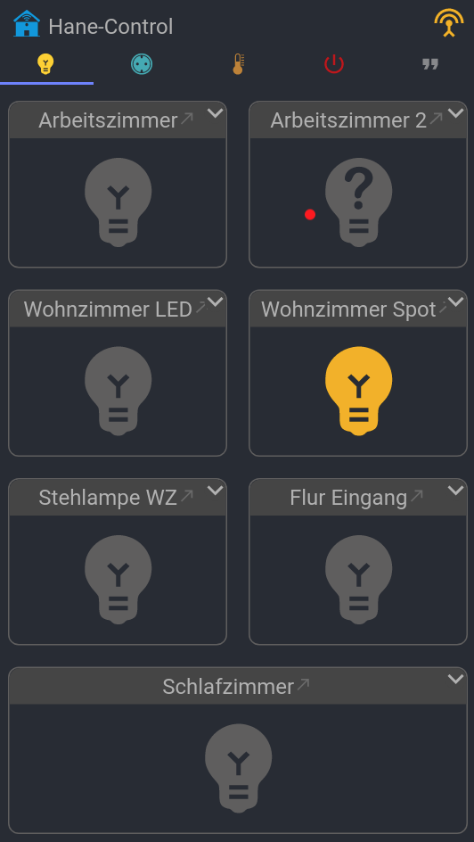
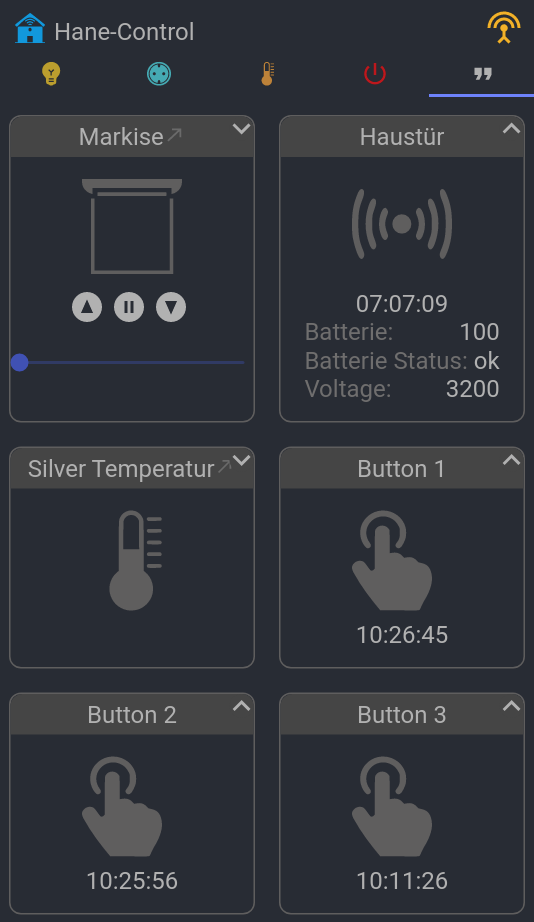

# hanectl
**hanectl** is a simple lightweight smarthome web application that can control/display IOT devices with MQTT and/or REST interface.
The UI can be opened in desktop browser as well as on mobile.
The backend is written in go, the ui in react.
All settings are defined in configuration files. Actions on changes can be scripted.

You need an MQTT Server like Eclipse Mosquitto.
If you have zigbee devices you should install Zigbee2Mqtt.

## Configuration

The configurations can be found under the **config** directory.
If you change any configuration you need to restart hanectl.

### config.yml
This is the main configuration file. It contains configuration for ports, services, directories, ...

The DeviceKey used in scripts or templates should be equal to the device_key inside
devices.yml.

### devices.yml
This file contains all known devices. You need to add new devices to this file.
There are some known device templates. If your devices is not included feel free to create your own template.
Important!: the used device_key should be unique! Do not confuse it with the device_id. This is given by the device itself.
You can assign your own device_key which should be unique!
The device tmeplates can be found under **config/scripts/templates/**. There are two directories. **commands** directory is for sending commands to the devices,
**events** directory is for receiving and parsing data from the devices.

### notifications.yml
When you want to trigger actions on changes you can write your own event handler. The example contains four examples.
The first one is "washing mashine is done" event, the second one the "3d printer is done", the third one "the door is opened".
Under the **keys** section you define the value(s) which trigger this event. The script is written in js and should be places under **config/scripts/notifications/**.

### users.yml
This is the user file. To create a password you can use the password binary which can be found under **dist/hanectl_pwdgen** after compilation.
Currently only ADMIn and USER groups are supported. The id should be unique!

## Installation
To build the project we need golang and nodejs with yarn installed.

First we need to download all dependencies for golang and react app.

In the root folder of your project type
```sh
go get -d ./...
```

Then change to frontend folder and type
```sh
yarn
```

Now we can build the project. There are some shell scripts in the bin directory.
To build a linux build type
```sh
bin/build_linux.sh
```

### Systemd

You should create a user hanectl with group hanectl to run the service. The example assumes that you have installed the files under /opt/hanectl

#### create this file under /lib/systemd/system/hanectl.service

```
[Unit]
Description=Hane-Ctl
After=network.target

[Service]
Type=simple
User=hanectl
Group=hanectl 

ExecStart=/opt/hanectl/hanectl -config /opt/hanectl/config/config.yml 

[Install]
WantedBy=multi-user.target

```

#### activate service
> sudo systemctl daemon-reload

> sudo systemctl enable hanectl

> sudo systemctl start hanectl

## Screenshots





